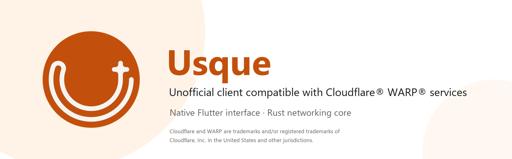
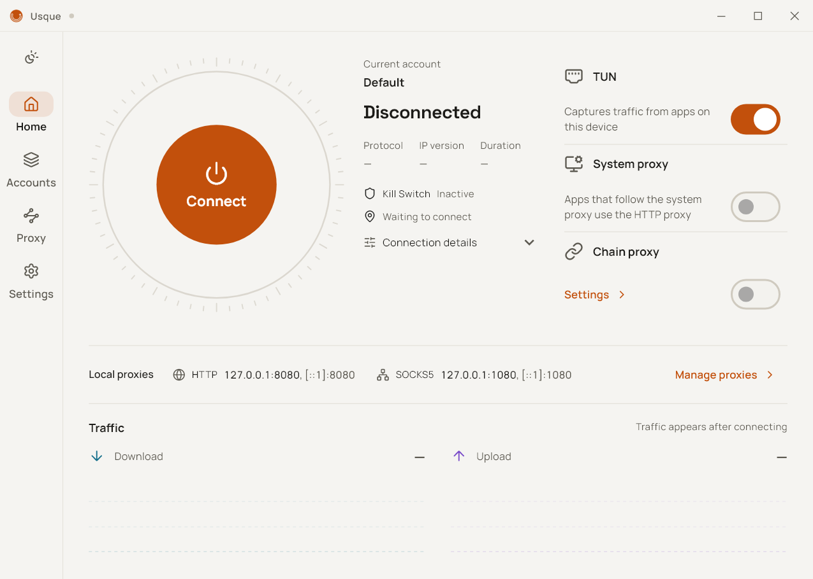
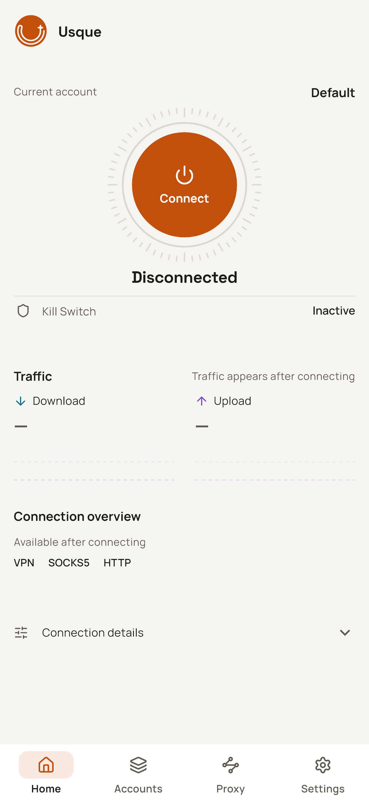

  

  <a href="README.md">English</a>
  ·
  <a href="README.zh-CN.md">简体中文</a>
  ·
  <a href="README.ja.md">日本語</a>
  ·
  한국어
  ·
  <a href="README.ru.md">Русский</a>
  ·
  <a href="README.fa.md">فارسی</a>

  
  
  
  

# Usque

Usque는 Windows와 Android / Android TV용 Cloudflare® WARP® 서비스와 호환되는 비공식 클라이언트입니다. 시스템 VPN, SOCKS5, HTTP 프록시를 네이티브 Flutter 인터페이스에 모으고, Rust로 구현한 MASQUE 엔진으로 통신을 처리합니다.

> [!IMPORTANT]
> 공식 패키지는 [GitHub Releases](https://github.com/GeorgeXie2333/usque-app/releases)에서만 다운로드하세요. Pull Request 산출물, 로컬 빌드, 태그가 없는 바이너리는 공식 릴리스가 아닙니다. 개발 브랜치 문서에는 아직 배포되지 않은 변경 사항이 포함될 수 있습니다. 사용 중인 패키지의 태그에 해당하는 릴리스 노트와 문서를 확인하세요.

Usque는 독립 프로젝트입니다. Cloudflare, Inc.와 제휴 관계가 없으며, 해당 회사의 후원이나 추천을 받지 않습니다. Cloudflare 및 WARP는 미국 및 기타 관할 지역에서 Cloudflare, Inc.의 상표 또는 등록 상표입니다. 개인용 WARP 서비스 사용에는 여전히 Cloudflare의 이용 약관과 개인정보 처리방침이 적용됩니다.

## 스크린샷

<table>
  <tr>
    <td align="center" valign="top">
      
<strong>Windows</strong>

      
    </td>
    <td align="center" valign="top">
      
<strong>Android</strong>

      
    </td>
  </tr>
</table>

현재 소스에서 렌더링한 영어 인터페이스 미리보기이며, 연결되지 않은 상태를 보여 줍니다.

## 다운로드 및 설치

이 개발 문서는 **v0.3.1** 준비용입니다. 앱 버전 메타데이터와 릴리스 워크플로는 **v0.3.1 / 0.3.1+25**로 동기화되었습니다. [v0.3.1 릴리스 준비 검토](docs/RELEASE_V0.3.1_READINESS.md)에 검사 결과와 남은 요구 사항을 기록했습니다. 배포된 패키지는 [GitHub Releases](https://github.com/GeorgeXie2333/usque-app/releases)와 해당 태그의 문서를 확인하세요. 계획된 설치 패키지는 6종이며, Windows MSI 파일 2개를 앱 내 업데이트 전용으로 별도 제공합니다.

| 플랫폼 | 최소 OS | 패키지 |
| --- | --- | --- |
| Windows | Windows 10 22H2, 빌드 19045 | x64-v2 또는 ARM64 EXE 설치 프로그램 |
| Android / Android TV | Android 8.0, API 26 | arm64-v8a, x86_64 또는 armeabi-v7a APK |
| Android / Android TV | Android 8.0, API 26 | 위의 ABI 3종을 모두 포함하는 범용 APK |

기기 아키텍처에 맞는 패키지를 선택하세요. Windows x64에는 **x86-64-v2**를 지원하는 CPU가 필요하며, ARM64 Windows에는 네이티브 ARM64 패키지를 사용합니다. Android ABI를 모르면 용량이 더 큰 범용 APK를 사용할 수 있습니다. 설치 전에 패키지의 SHA-256을 `SHA256SUMS` 및 GitHub에 표시된 파일 다이제스트와 대조하고, 릴리스 노트에 명시된 서명자 지문도 확인하세요. 하나라도 일치하지 않으면 설치를 중단하세요.

1.0 이전 패키지는 프로젝트에서 관리하는 고정된 자체 서명 인증서를 사용합니다. Windows에는 알 수 없는 게시자 경고가 나타날 수 있으며, Android 패키지는 Google Play 밖에서 설치합니다. 경고를 우회하려고 백신이나 방화벽을 끄거나 비공식 패키지에 포함된 인증서를 가져오지 마세요.

업그레이드, 제거, 복구, Android 개발자 인증에 관한 설명은 [설치 및 제거](docs/INSTALLATION.md)를, 공식 서명에 사용하는 인증서 정보는 [코드 서명](docs/CODE_SIGNING.md)을 참고하세요. 업데이트는 다운로드 전에 확인이 필요하며, 플랫폼 설치 프로그램으로 설치합니다. 사용자 확인 없이 자동으로 설치하지 않습니다.

v0.3.0에서 업그레이드하면 구성 스키마가 23에서 24로 바뀌며 v0.3.0 및 이전 클라이언트에서는 읽을 수 없습니다. 업그레이드 전에 [구성 호환성](docs/INSTALLATION.md#configuration-compatibility-when-upgrading)과 필요한 백업을 확인하세요. 이전 패키지를 다시 설치해도 마이그레이션은 되돌려지지 않습니다.

## 첫 연결

1. [검증된 공식 패키지](docs/INSTALLATION.md#verify-before-installing)를 설치하고 Usque를 엽니다.
2. 첫 실행의 권한 및 약관 단계를 완료합니다. Android에서는 설정을 마치려면 VPN 권한이 필요합니다. 권한을 허용하면 다른 VPN의 연결이 끊길 수 있지만, 그 자체로 Usque 연결을 시작하지는 않습니다. 알림 권한은 선택 사항입니다. 개인용 WARP® 계정을 등록하고, 필요하면 WARP License Key를 입력합니다. 설정이 중단되었다면 다시 등록하기 전에 저장된 결과를 확인하세요. 새 WARP Secret 가져오기는 지원하지 않습니다.
3. Windows에서는 **프록시 → 가상 네트워크 어댑터 및 로컬 프록시**, Android에서는 **프록시 → VPN 및 로컬 프록시**를 열어 사용할 연결 방식을 선택한 다음 홈에서 연결합니다. 스위치는 즉시 적용됩니다. 수신 대기 주소 양식을 수정했다면 **변경 적용**이 필요합니다. 프록시만 사용하는 모드에서는 이미 받은 VPN 권한으로 VPN을 시작하지 않습니다.

| 연결 방식 | 용도 |
| --- | --- |
| VPN/TUN | 우회 규칙과 Android 앱별 설정에 따라 시스템 트래픽을 터널로 보냅니다. |
| SOCKS5 | 지원하는 앱에 로컬 TCP/UDP 프록시를 제공합니다. 기본적으로 원격 DNS 조회를 사용합니다. |
| HTTP 프록시 | 지원하는 앱에 로컬 HTTP 프록시를 제공하며, CONNECT를 통한 HTTPS도 지원합니다. |
| Windows 시스템 프록시 | Windows 프록시 설정을 Usque의 HTTP 프록시로 지정합니다. HTTP 연결 방식이 켜져 있어야 합니다. |

VPN, SOCKS5, HTTP는 기본적으로 켜져 있고, Windows 시스템 프록시는 꺼져 있습니다.
이들은 하나의 WARP 연결을 공유하며 동시에 사용할 수 있습니다. 모두 끄면 전송 연결은 유지되지만, 위의 앱용 연결 방식은 더 이상 제공하지 않습니다.
인증 정보는 계정별로 저장하며, 한 번에 하나의 계정만 연결할 수 있습니다.
네트워크 설정은 모든 계정이 공유합니다.

## 주요 기능

- 선택적으로 사용하는 [체인 프록시](docs/CHAIN_PROXY.md). **프록시 → 체인 프록시**에서
  **OpenVPN**, **WireGuard**, [**WARP via WireGuard**](docs/WARP_WIREGUARD.md),
  **VPN Gate**, **HTTP**, **SOCKS5** 순서로 출구를 선택할 수 있습니다.
  VPN 구성을 가져오거나 프록시 서버를 추가한 뒤 하나를 선택하고 적용합니다.
  VPN, SOCKS5, HTTP는 같은 최종 출구를 사용하며, 명시적인 직접 연결 규칙은 계속 적용됩니다. 기본값은 꺼짐입니다.
- 직접 켜서 사용하는 [실험적 L4 모드](docs/L4_PROXY.md)는 HTTP/3을 통해 TCP를 프록시합니다.
  OpenVPN TCP 체인 출구가 없으면 일반 UDP를 전달하지 않으므로, UDP가 필요한 앱은 작동하지 않을 수 있습니다.
  자동 모드는 L4를 선택하지 않습니다.
- HTTP/3 자동 연결과 실패 시 HTTP/2 폴백. IPv4와 IPv6 연결 시도로 접근 가능한 엔드포인트를 찾습니다.
  지원되는 네트워크 변경에서는 H3 연결을 이동할 수 있습니다. [경로 동작](docs/h3-path-infrastructure.md)을 참고하세요.
- 전체 터널 VPN, 터널 내 DNS, Kill Switch, LAN 접근 및 [DIRECT/REJECT/PROXY 분할 라우팅과 Ads](docs/ROUTING.md). 도메인과 CIDR은 더 구체적인 예외를 지원하며 저장 전에 충돌을 검사합니다.
- 사용자 지정 [WARP 출구 DNS](docs/WARP_DNS.md): **설정 → 고급 네트워크 설정 → WARP DNS**를 열어 일반 DNS, DoH 또는 DoT를 선택하고 **변경 적용**을 누릅니다. DNS를 변경하면 연결 중인 세션이 다시 연결되며, 최종 체인 출구는 자체 DNS 정책을 유지합니다.
- 선택적인 국가별 직접 연결 라우팅. 선택한 국가의 GeoIP 데이터와 전체 GeoSite 목록을 별도로 다운로드합니다.
  도메인 이름이 보이면 도메인 규칙을, 그렇지 않으면 IP 규칙을 사용합니다. 분류하지 못한 대상은 계속 터널을 사용합니다.
- 로컬 [네트워크 진단](docs/network-doctor.md)과 네트워크 품질 페이지. 지연 시간, 패킷 손실과 측정 가능 여부, 대기열, 최근 60초 추이를 표시합니다.
  표준 검사는 로컬 상태만 읽으며, 심층 검사는 확인을 받은 뒤 테스트 요청을 보냅니다.
- Windows의 트레이(상태 배지, 가상 네트워크 어댑터와 시스템 프록시 스위치, 백그라운드에서 5초간 지속되는 재연결·연결 오류·알림으로 보고된 중단 후 복구 알림), 단일 인스턴스 활성화, 시작 시 실행, 창을 닫으면 트레이로 최소화하는 기능, 창 위치 기억, 키보드 단축키.
  **Ctrl+1~4**로 페이지 전환, **Ctrl+S**로 변경 적용, **F5**로 VPN Gate 또는 진단을 새로 고칩니다. [트레이 및 키보드 조작](docs/INSTALLATION.md#tray-and-keyboard-controls)을 참고하세요.
  Android의 빠른 설정 타일, 런처 바로가기, 재부팅 후 복구, TV 리모컨 탐색.
  21개 언어와 밝은 테마 및 어두운 테마를 지원합니다.
- 확인 후 개인용 WARP Secret을 선택한 파일로 내보낼 수 있습니다.
  Usque는 이 파일 가져오기를 지원하지 않으므로, 재설치 후 계정 복원에 사용할 수 없습니다.

Android의 **앱별 프록시**는 모든 계정에 걸쳐 앱 전체에 적용됩니다. 꺼져 있으면 모든 앱이 VPN을 사용합니다.
켜져 있으면 선택한 앱만 사용하며, 새로 설치한 앱은 직접 선택해야 합니다.
Android의 **VPN을 사용하지 않는 연결 차단**도 켜져 있으면, 선택하지 않은 앱은 터널을 우회하는 대신 연결이 차단됩니다.

## 개인정보 보호와 제한 사항

- WARP 서버의 공개 키가 등록된 키와 일치해야 합니다. 검증을 건너뛰는 옵션은 없습니다.
  인증 정보는 Windows 자격 증명 관리자 또는 Android Keystore에 보관합니다.
  Windows에서는 별도 Agent가 권한이 필요한 네트워크 작업을 처리하며, Android에서는 VPN을 전용 프로세스에서 실행합니다.
- 프록시는 기본적으로 루프백 주소에서만 수신 대기합니다. SOCKS5와 HTTP는 선택적인 사용자 이름·비밀번호 인증을 지원하며, 인증 정보를 설정하지 않으면 인증을 요구하지 않습니다.
  프록시 전용 모드는 시스템 전체의 VPN Kill Switch를 제공하지 않습니다.
- 진단은 로컬에서 생성하고 민감한 정보를 제거합니다. 사용 분석이나 자동 업로드는 없으며, 품질 기록은 메모리에만 보관합니다.
  기본 로그 수준은 INFO이고, 보관 한도는 7일 또는 20 MiB입니다. 인증 정보나 원본 진단 묶음을 공개 Issue에 올리지 마세요.
  취약점은 [SECURITY.md](SECURITY.md)의 절차에 따라 비공개로 신고하세요.
- Android의 앱 내 Kill Switch는 VPN 프로세스가 종료된 뒤에는 트래픽을 보호할 수 없습니다. VPN Gate의 종료를 유발하는 오류도 연결을 끝냅니다.
  VPN이 끝난 뒤에도 앱 연결을 차단하려면 시스템의 **항상 사용 VPN**과 **VPN을 사용하지 않는 연결 차단**을 모두 켜세요.
  [Android 설정](docs/INSTALLATION.md#android-and-android-tv)을 참고하세요.
- 여러 경로를 묶어 대역폭을 늘리는 기능은 없습니다. HTTP/2 패킷 손실과 PMTU 등 일부 품질 지표는 측정할 수 없습니다.
  로컬 진단 통과가 트래픽 누출이 없거나 성능이 향상되었다는 증거는 아닙니다.

### DNS 개인정보 보호

국가 및 사용자 지정 도메인의 직접 연결 규칙은 기본적으로 **현재 네트워크 DNS**를 사용합니다. 일치하는 도메인 질의는 VPN 밖에 있는 현재 네트워크의 DNS 서버로 전송됩니다.
대신 **DoH**에는 전체 HTTPS URL을, **DoT**에는 서버 이름과 포트를 입력할 수 있습니다.
새 초안에는 Cloudflare가 미리 입력되며, 저장된 사용자 지정 설정은 유지됩니다.
이 리졸버가 질의를 받으며, 연결에 실패해도 평문 DNS로 바뀌지 않습니다.
[설정 단계와 예시](docs/encrypted-direct-dns.md)를 참고하세요.

그 밖의 원격 VPN 질의는 WARP 터널 또는 선택한 최종 체인 출구를 사용합니다.
HTTP/SOCKS5 체인 DNS는 기본적으로 해당 프록시를 통해 TLS를 검증하는 Cloudflare® DoH를 사용합니다.
사용자 지정 DNS나 기본값과 다른 상속 DNS는 TCP DNS를 유지합니다. 이 두 출구에서는 앱이 선택한 리졸버로 보내는 UDP/53 질의를 같은 리졸버로 보내는 TCP 질의로 변환하며, 물리 네트워크 DNS로 폴백하지 않습니다.
[체인 DNS 선택지](docs/CHAIN_PROXY.md#http-and-socks5-exits--http-与-socks5-出口)를 참고하세요.
앱 자체의 암호화 DNS를 사용하면 Usque가 도메인 이름을 볼 수 없으므로, 직접 연결 라우팅에는 IP 규칙을 사용합니다.
연결이 끊긴 상태의 규칙 다운로드도 Android Lockdown 및 Windows에 남아 있는 Kill Switch의 제한을 따릅니다.

### 실험적 기능과 지원하지 않는 범위

[Zero Trust 등록](docs/ZERO_TRUST_EXPERIMENTAL.md)은 실험적 기능입니다. 조직의 ID로 MASQUE 인터넷 터널을 구성하지만, Cloudflare One™ Client의 모든 기능과 호환되지는 않습니다.
macOS 소스는 보존하고 있으나 빌드하거나 배포하지 않습니다.
iOS, 앱 스토어 배포, 공개 CLI는 이번 릴리스 범위에 포함되지 않습니다.

## 기본 네트워크 설정

| 설정 | 기본값 |
| --- | --- |
| 개인용 엔드포인트 선택 | 자동 선택. 기존 구성은 사용자 지정 유지 |
| 저장된 사용자 지정 IPv4 엔드포인트 | `162.159.198.2` |
| 저장된 사용자 지정 IPv6 엔드포인트 | `2606:4700:103::2` |
| 포트 / SNI | `443` / `speed.cloudflare.com` |
| 전송 | 자동: HTTP/3, 그다음 HTTP/2 |
| HTTP/3 혼잡 제어 | `cubic`. BBRv2, 실험적 BBRv3, `reno`도 선택 가능 |
| QUIC UDP 수신 버퍼 | Windows/Android의 H3와 L4에서 [2 MiB를 목표](docs/UDP_RECEIVE_BUFFER.md)로 요청. 실제 용량은 OS에 따라 다름 |
| TUN MTU | `1280` |
| 폴백 DNS | `1.1.1.1`, `2606:4700:4700::1111` |
| SOCKS5 | `127.0.0.1:1080`, `[::1]:1080` |
| HTTP 프록시 | `127.0.0.1:8080`, `[::1]:8080` |

프록시 주소와 포트 수정은 변경을 적용하기 전까지 초안입니다. 프록시 DNS는 기본적으로 현재 출구를 사용합니다. 고급 설정에서 [WARP DNS](docs/WARP_DNS.md)를, 체인 설정에서 최종 출구 DNS를 구성하세요. 프록시 화면에는 DNS 설정 항목이 없습니다. 이전 버전에서 저장한 프록시 DNS 설정은 계속 적용됩니다.

고급 설정의 초기화는 기본값을 초안에 불러올 뿐 즉시 적용하지 않습니다.

Zero Trust는 처음에 등록된 주소를 사용합니다. 고급 네트워크 설정에서 **Zero Trust 엔드포인트 편집**을 선택하고 빨간색 전체 화면 경고를 읽은 뒤 위험과 사용 권한을 확인하여 IPv4/IPv6를 편집하고 변경을 적용하세요. 초기화는 등록된 주소를 초안에 불러오며, 다시 로그인하면 등록된 주소가 복원되고 사용자 지정 주소가 제거됩니다. 선택한 계정에 사용자 지정 Zero Trust 주소가 설정되어 있거나 현재 ZT 연결이 해당 주소를 사용하는 동안 홈에 닫을 수 없는 위험 안내가 표시됩니다.

고급 네트워크 설정의 자동 선택은 계정에서 사용 가능한 엔드포인트에 병렬로 연결을 시도하며, 사용자 지정은 수동 주소를 유지합니다. 포트와 SNI는 두 모드 모두 수정할 수 있습니다. [자동 엔드포인트 선택](docs/NETWORK_SETTINGS.md#automatic-endpoints--自动选择端点)을 참고하세요.

혼잡 제어 변경은 저장된 뒤 다음 수동 연결이나 재시도에서 적용됩니다. 현재 세션과 그 세션의 자동 재연결에는 적용하지 않습니다.
HTTP/2는 시스템 TCP를 사용합니다. [HTTP/3 혼잡 제어](docs/congestion-control.md)를 참고하세요.

## 문서와 개발

설정과 실용적인 사용 방법은 [Wiki](https://github.com/GeorgeXie2333/usque-app/wiki/Home)에서 시작하세요. 전체 참고 자료는 [문서 목록](docs/README.md)에 있으며, 기술 문서는 대부분 영어입니다.

| 필요한 정보 | 읽을 문서 |
| --- | --- |
| 설치, 업데이트, 제거, 복구 | [설치](docs/INSTALLATION.md) |
| WARP를 통해 Proton VPN에 연결 | [WireGuard over MASQUE 튜토리얼](https://github.com/GeorgeXie2333/usque-app/wiki/Proton-VPN-over-MASQUE) |
| 로컬 품질 검사의 의미 | [Network Doctor](docs/network-doctor.md) |
| 변경 사항의 안전한 빌드 및 테스트 | [기여 안내](CONTRIBUTING.md) |
| 구현 및 검증 상태 | [구현 현황](docs/IMPLEMENTATION.md) |
| 공식 릴리스 관리 | [릴리스 절차](docs/RELEASE.md) |

기여 안내의 고정된 도구 체인과 변경 범위별 검사를 사용하세요. 컴파일만 하는 빌드와 결정론적 테스트는 개발용 PC에서 실행할 수 있습니다.
개발 패키지 설치나 VPN 수명 주기 검증에는 지정된 격리 환경이 필요합니다. 빌드 성공은 설치, 누출, 성능 검증을 의미하지 않습니다.

## 업스트림과 라이선스

프로토콜 동작은 [Diniboy1123/usque](https://github.com/Diniboy1123/usque)를 참고합니다. 이 저장소는 상호 운용성 테스트를 위해 해당 클라이언트의 스냅샷을 `oracle/go`에 보관합니다. Flutter UI와 Rust 엔진은 새로 구현한 코드입니다. 업스트림 저작권 표시는 라이선스에 유지합니다.

프로젝트 소스는 [MIT](LICENSE.md) 라이선스입니다. 서드파티 구성 요소는 각자의 라이선스를 유지합니다.
선택적인 [체인 프록시](docs/CHAIN_PROXY.md)는 MPL-2.0의 OpenVPN 3 Core와 Apache-2.0의 Mbed TLS를 포함합니다.
해당 소스, 검토한 패치, 라이선스 전문은 `third_party`에 있으며, 앱의 VPN Gate 페이지에서 라이선스 고지를 확인할 수 있습니다.
WireGuard는 BoringTun 0.7.1(BSD-3-Clause)을, 로컬 SVG 아이콘은 flutter_svg 2.3.0(MIT)을 사용합니다. 해당 고지는 앱의 라이선스 목록에도 포함되어 있습니다.

---

Cloudflare, WARP 및 Cloudflare One은 미국 및 기타 관할 지역에서 Cloudflare, Inc.의 상표 또는 등록 상표입니다.
