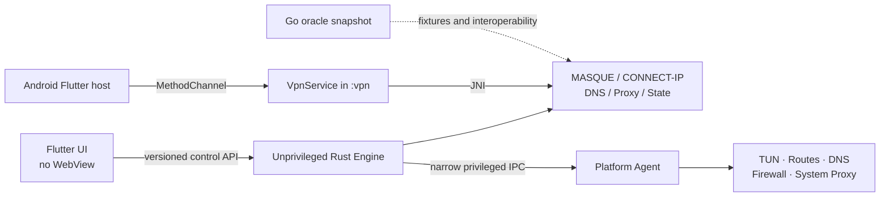

# Usque implementation progress

This is the source-tree checklist for Windows and Android / Android TV, not a
release changelog or a test-run report. A development branch can contain work
not present in the latest package. macOS source is kept for later work and is
not built, packaged, or tested for the current release.

- A checked implementation item means code or test infrastructure is in the
  tree. It does not certify that every test passed at the reader's commit or
  that a protected runner exercised it.
- An unchecked item means implementation or the stated validation is still
  outstanding. Missing isolated-environment evidence must remain explicit.
- Use the exact commit's CI results and candidate-bound reports for execution
  evidence. Historical test counts and baselines are not current results.

The [documentation index](README.md) separates current contracts from historical
records. [Reliability testing](RELIABILITY_TESTING.md) defines environments and
evidence requirements; [Release process](RELEASE.md) defines publication.

## Source changes prepared for v0.3.1

Since the v0.3.0 tag, source adds [DIRECT/REJECT/PROXY rules and Ads](ROUTING.md),
migrates legacy bypass targets, and applies Allow local network across outputs.
The [H3 startup and PMTU fixes](h3-client-reliability.md#pmtu-and-fragmentation)
retain ordinary traffic during discovery and oversized-probe rejection.
These are source behaviors, not measured throughput or external leak results.

[WARP DNS](WARP_DNS.md) and [Direct DNS](encrypted-direct-dns.md) now use complete
DoH URL fields and editable Cloudflare defaults for new encrypted drafts.
Local proxy DNS controls have been removed while saved settings remain active
internally; HTTP/SOCKS5 chain DNS choices remain in Add proxy. Settings are
organized by topic and VPN Gate uses only the shared chain-proxy editor.
Android tile recovery and hidden-UI observation have changed; adaptive icons use
an opaque brand-orange background. [GUI development](../apps/usque_gui/README.md)
describes the current components and layout.

The current source retains v0.3.0's WARP encrypted DNS, confirmed experimental
Zero Trust endpoint editing, native Windows setup/removal, tray controls,
desktop shortcuts and established Android protection-failure recovery. They
are not newly introduced v0.3.1 features. TLS, endpoint pins and distinct WARP,
direct and final-chain DNS policies remain in force.

Configuration schema advances from v0.3.0's 23 to 24: legacy domains and CIDRs
migrate to DIRECT and countries are retained. Custom CIDRs now route inside the
application data plane. Recovery journal 5, Agent protocol 3 and sanitized
recovery export 2 remain unchanged. A v0.3.0 or older engine rejects schema 24;
see [upgrade compatibility](INSTALLATION.md#configuration-compatibility-when-upgrading).

v0.3.1 is the preparation target. Executable version metadata and the tag
workflow now target v0.3.1 / 0.3.1+25; this does not establish publication.
Use [release preparation](RELEASE.md#preparing-v031) and the
[v0.3.1 readiness review](RELEASE_V0.3.1_READINESS.md) for open requirements;
this checklist is not candidate-bound execution evidence.

## Architecture

### Network-quality implementation

The PR-00 through PR-12 sequence adds explicit H2 receive windows and PING RTT,
typed 1 Hz local metrics, strict performance-v2 evaluation, bounded UDP batch
I/O/owned buffers, automatic outer PMTU, same-family H3 migration, explicit
encrypted direct DNS, and the Quality/Doctor UI. The final
[acceptance matrix](network-quality-acceptance.md) maps every planned item to
its code, deterministic test, documentation, and protected `not_run` status.
No controlled throughput, allocation, migration-latency or leak claim follows
from a workstation test. Protected results remain optional for publication.

Five immutable build defaults are centralized in `feature_flags.rs`; normal
profiles and environment variables cannot change them. See the
[rollback runbook](network-quality-rollback.md) and
[DNS threat model](direct-dns-threat-model.md). Android Doctor now reads the
bounded Rust timeline on demand through JNI/Binder, with an old-engine fallback.

### Platform layout

Desktop UI and engine remain unprivileged. The desktop agent accepts only versioned, authenticated operations for TUN, routes, DNS, firewall state, and system proxy state. Android hosts the Rust `cdylib` inside the dedicated `:vpn` process.

## Milestone 1 — repository and contracts

- [x] Move the upstream Go CLI unchanged to `oracle/go`.
- [x] Create the Rust workspace and Flutter platform hosts.
- [x] Pin Rust and Flutter versions, Cargo/Flutter/Gradle dependency lockfiles,
  the Gradle distribution checksum, and Gradle artifact verification metadata.
- [x] Define `usque.v1` protobuf requests, responses, events, and structured errors.
- [x] Add bounded incremental protobuf framing and checked-in v1 wire snapshots.
- [x] Implement versioned profile defaults, validation, forward migration backup, and atomic JSON replacement.
- [x] Implement the fixed connection-state transition guard.
- [x] Add English/Chinese README, security policy, attribution, and reproducible brand-asset generation.
- [x] Freeze sanitized Go-oracle defaults, H2 request, and capsule fixtures and enforce them in Rust tests.
- [ ] Freeze independently reviewed, sanitized Go-oracle packet captures from controlled interoperability tests.
- [x] Add protobuf backwards-compatibility snapshots, including identity provisioning.

## Milestone 2 — Rust network core

- [x] Encode/decode QUIC variable integers and CONNECT-IP datagram context IDs.
- [x] Implement Auto transport orchestration with H3-to-H2 fallback decisions.
- [x] Implement IPv4/IPv6 Happy Eyeballs scheduling with one winning physical
  endpoint path while keeping CONNECT-IP payload IPv4/IPv6 independent.
- [x] Model strict endpoint-pin requirements and structured failures.
- [x] Implement IP.SB dual-stack and geo-location probing interfaces.
- [x] Add log redaction for secret fields and values.
- [x] Implement Consumer WARP® and WARP License Key registration; retain Secret parsing for stored identities with zeroized temporary buffers. New Secret import is removed from the UI and rejected by the provisioning API.
- [x] Add experimental Zero Trust Access callback exchange, secure provider metadata plus a non-secret profile binding, registered endpoint discovery, and rollback-safe profile commits.
- [x] Port the Abobo7 P-256 Endpoint Pin semantics and authenticated one-shot refresh.
- [x] Implement bounded RFC 9484 ADDRESS_ASSIGN, ADDRESS_REQUEST, and ROUTE_ADVERTISEMENT codecs.
- [x] Implement the engine-side protobuf control service and serialized, atomic Profile CRUD.
- [x] Implement the pinned HTTP/3 + QUIC data path with `quiche`, CUBIC, pacing, and CONNECT-IP datagrams.
- [x] Interoperate with the live service through forced-H3 and Auto SOCKS5 TCP smoke tests without TUN.
- [ ] Harden H3 flow control, cancellation, reconnect, probe, and hostile-network behavior for release.
- [x] Implement the pinned production HTTP/2 + TCP + TLS tunnel with `h2` and BoringSSL.
- [x] Apply RFC 9484 ADDRESS_ASSIGN / ROUTE_ADVERTISEMENT on the HTTP/2 CONNECT-IP request stream with the same userspace peer-network state as HTTP/3; reject ADDRESS_REQUEST with unspecified ADDRESS_ASSIGN.
- [x] Apply peer address/route replacements as fail-closed full-tunnel policy,
  degrade withdrawn families, and generate/process required ICMP errors.
- [x] Implement tunnel DNS for the SOCKS5 TCP data path.
- [x] Apply default or user-configured VPN DNS on Windows and Android, filter
  single-family plans, and reject system/LAN/CIDR/endpoint DNS leak paths.
- [x] Implement SOCKS5 TCP.
- [x] Implement SOCKS5 UDP ASSOCIATE with tunnel-only forwarding, source binding, and idle cleanup.
- [x] Interoperate SOCKS5 TCP and UDP over forced H3 and forced H2 live paths without TUN.
- [x] Implement HTTP CONNECT and ordinary Forward with bounded parsing and strict body framing.
- [x] Interoperate HTTP CONNECT and Forward over forced H3 and forced H2 live paths without TUN.
- [x] Download bounded GEO rule data from allowlisted jsDelivr paths, verify per-country GeoIP and the global V2Fly `dlc.dat` checksum/content, atomically retain the last valid cache, and load immutable fail-closed classifiers.
- [x] Route selected SOCKS5 TCP/UDP and HTTP destinations over protected direct sockets, using GeoSite for hostnames and GeoIP for literals, with MASQUE fallback on direct setup failure.
- [x] Replace fixed 64 KiB proxy TCP windows with bounded preferred/fallback tiers,
  CUBIC, disabled Nagle, 128 KiB bidirectional relays, and a 1024-packet pipe.
- [x] Reuse up to two idle HTTP/1.1 upstream connections per authority within each
  local client session, with a 32-connection cap, 90-second expiry, and one safe
  bodyless retry after a stale keep-alive connection.
- [x] Emit redacted proxy memory-tier and HTTP-pool counters into local diagnostics.
- [ ] Gate `smoltcp` against the Go oracle performance and compatibility thresholds.
- [x] Add jittered ten-minute H3 recovery probes after an H2 fallback and atomically retain only one active channel.

## Milestone 3 — platform slices

### Windows

- [x] Current-user SID-scoped Named Pipe ACL and bounded protobuf server.
- [x] Connect the Flutter Windows host to the Named Pipe client, sidecar lifecycle, Profile sync, and Active Profile selection.
- [x] Stream snapshots and capability events over an independent user-scoped Named Pipe into Flutter `EventChannel`; remove Windows UI polling.
- [x] Narrow Windows service/agent IPC with SID, executable-path, and Authenticode signer checks.
- [x] Implement Wintun session ownership, shared-memory packet rings, endpoint bypass, dual-stack route/DNS plans, and a write-ahead cleanup journal.
- [x] Implement a persistent Windows Filtering Platform Kill Switch and fail-closed Agent/Engine reattachment after either process restarts.
- [x] Add Agent protocol v3 physical-DNS snapshots and reference-counted, pipe-leased exact WFP permits so Windows TUN can route GeoSite/GeoIP hits directly without a broad Engine egress rule.
- [x] Run bounded UDP/TCP Split DNS at `198.18.0.1` / `fd00::1`, classify QNAME before upstream selection, retry truncated UDP over TCP, and cache only question-reachable A/AAAA hints.
- [x] Credential Manager vault backend for all identity record types.
- [x] Export a saved Secret only after explicit confirmation to a user-selected destination, without revealing it in the UI or diagnostics.
- [x] Implement transactional system-proxy snapshot, apply, and crash/uninstall recovery.
- [x] Add WiX 5 MSI authoring, a selectable and upgrade-persistent install
  directory, a default-off current-user data purge choice, exact
  Wintun/signature validation, Agent service installation, and fatal
  uninstall/upgrade recovery sequencing.
- [x] Remove crash-surviving Usque Wintun devices by journaled name/GUID/LUID,
  distinguish true uninstall from major upgrade, and delete only proven-clean
  machine recovery state before MSI removes the Agent binary.
- [x] Signed x64-v2 and ARM64 update MSIs plus localized installer bundles,
  with signer-pinned cleanup of hidden Burn registration after direct MSI
  uninstall.
- [ ] Isolated clean-install, upgrade, and uninstall validation.

### Android and Android TV

- [x] API 26 minimum, TV Leanback entry, and non-touchscreen compatibility.
- [x] Dedicated `:vpn` process, `VpnService`, foreground notification, control Binder, and JNI boundary.
- [x] Fail closed before creating the VPN if the Rust data channel is unavailable.
- [x] Wire arm64-v8a, x86_64, and armeabi-v7a Rust targets into the Gradle release build and produce a universal APK.
- [x] Transfer connection snapshots from `:vpn` to the UI over a bounded-time Binder request.
- [x] Validate serialized WARP identity material in Rust for Android secure storage and startup. Retained parsers do not enable new Secret imports.
- [x] Stream native events/counters from `:vpn` through Binder callbacks and Flutter `EventChannel`.
- [x] Automatic Consumer registration through Rust before Android Keystore persistence.
- [x] Export a saved Secret through Android SAF after explicit confirmation, without revealing it in the UI or diagnostics.
- [x] Implement `VpnService.Builder` address/DNS setup, API 26–32 CIDR complements, API 33+ exclusions, a 256-route ceiling, retained TUN reconnects, `protect(fd)`, and underlying-network rebinding.
- [x] Terminate GeoIP- or GeoSite-hint-selected Android TUN TCP/UDP flows in a bounded userspace gateway and relay them through protected sockets bound to the selected physical network.
- [x] Snapshot Android `LinkProperties.dnsServers`, publish internal Split DNS routes, and fail VPN startup if a valid physical DNS path is unavailable.
- [x] Add device-scoped Android per-app proxy (include-only `addAllowedApplication`) stored in app settings, not the Profile.
- [x] Fail-closed Android reconnect: retain the TUN fd when Kill Switch is armed and the address/DNS/MTU/route identity is unchanged; establish a replacement TUN before closing the old one when that identity changes.
- [x] Expose Android start-on-boot, Quick Settings tile request, and a deep link to system Always-on VPN settings.
- [ ] Sleep, network-switch, and TV lifecycle tests.

### macOS (deferred; not a current release gate)

- [x] Current-user Unix Socket permissions, peer-UID validation, and protobuf engine IPC.
- [x] Connect the Flutter macOS host to the Unix Socket client and sidecar lifecycle.
- [ ] Minimal launch daemon/helper and authorization flow.
- [ ] utun, route, resolver, PF Kill Switch, and recovery journal.
- [x] Keychain storage for all identity record types.
- [ ] LocalAuthentication re-authentication for reveal/copy/export operations.
- [ ] System proxy snapshot, apply, and crash/uninstall recovery.
- [ ] macOS 12+ Universal and macOS 10.15–11.7 Intel-compatible PKG packaging.

## Milestone 4 — Flutter UX

- [x] Responsive Home, Accounts, Proxy, Settings, Advanced, and Diagnostics/About pages.
- [x] Four-step permissions, terms, and Consumer WARP or experimental Zero Trust identity onboarding.
- [x] White/orange visual system, dark mode, Lucide controls and bundled protocol, flag and brand assets.
- [x] Exact default endpoints, SNI, MTU, DNS, listener addresses, and reset action.
- [x] Composable VPN/SOCKS5/HTTP outputs, Windows system-proxy dependency, and non-loopback listener warning.
- [x] Proxy DNS through the current exit by default. The Proxy page DNS selector was removed; saved custom/system/proxy-server modes remain supported, with the local-DNS leak warning.
- [x] Exit location, IPv4, IPv6, protocol, family, duration, and traffic UI.
- [x] Twenty-one string catalogs, including English and three Chinese regional catalogs.
- [x] Adaptive desktop/mobile navigation and focusable Material controls.
- [x] Retain a bounded, corruption-safe one-time reader for the legacy Flutter Profile draft.
- [x] Make versioned Rust configuration the authoritative Profile store on Windows and Android, then remove the migrated Flutter draft.
- [x] Connect desktop and Android identity provisioning to their platform vaults.
- [x] Add Windows manual Zero Trust callback entry and an Android process-local, same-team, single-consumption protocol callback.
- [x] Add Windows clipboard fill, live Access-callback validation, login-scoped current-user HKCU protocol association with automatic restoration, and single-instance URI forwarding.
- [x] Add a Windows tray status badge, tray TUN/system-proxy items, background connection notifications, restored window placement and desktop keyboard shortcuts.
- [x] Keep identity plaintext hidden while supporting explicit, confirmed Secret export to a user-selected destination.
- [x] Add shared network-output toggles across accounts, runtime-aware frontend status chips, shared-session totals, WARP License Key management, and platform quick actions.
- [x] Validate and explicitly apply proxy drafts, report local save outcomes, guard unapplied advanced edits, and keep apply actions visible while scrolling.
- [x] Apply online output changes through a rollback-capable desktop reconnect or one controlled Android reconnect.
- [x] Keep the MASQUE session across supported SOCKS/HTTP listener and Windows system-proxy lease changes; classify VPN attach/detach with the [core reconfiguration rules](../crates/usque-core/src/reconfigure.rs). Reconnect for mode-dependent routing, DNS or protection changes; advertise `hot_reconfigure`.
- [x] Surface real Kill Switch / Always-on / Lockdown state on Home and wire Retry to the existing control retry path.
- [x] Honor profile `auto_connect` once at process start (and Android boot when start-on-boot is also on).
- [x] Apply supported frontend changes while retaining the same MASQUE channel. Replaced SOCKS/HTTP listeners close their existing client flows; retaining the underlay does not guarantee uninterrupted application traffic.
- [x] Render bundled Flagpedia PNG flags by country code in Home, VPN Gate and Geo direct settings. Exit probes fetch only IP and location data; legacy flag wire fields remain compatible. See [country flag resources](COUNTRY_FLAGS.md).
- [x] Add diagnostics content review plus Windows and Android native save pickers; exported bundles contain bounded sanitized summaries and logs.
- [x] Add manual and rate-limited automatic GitHub release checks without automatic installation.
- [x] Add the direct-country rule download/update/search panel, cached-state gating, partial-result feedback, and accessible enable controls.
- [x] Add privacy-filtered 7-day/20-MiB JSON log rotation on Windows and Android.
- [x] Add widget tests for Simplified Chinese dark mode at 200% scaling and Android TV D-pad navigation.
- [ ] Add deterministic pixel-golden coverage for every declared theme, locale, and viewport matrix.

## Milestone 5 — release hardening

- [x] Add an exact-candidate H3/H2 endpoint and independent IPv4, IPv6, DNS, Kill Switch, route, and direct-rule observer gate.
- [x] Add a protected Windows snapshot-VM matrix for clean install, upgrade, connected uninstall, Engine/Agent failure, sleep/network change, platform-state restoration, and Wintun residue.
- [x] Add a protected Android physical-device matrix for network changes, airplane mode, Doze, process reclamation, Always-on, Lockdown, reboot, upgrade, and TV lifecycle.
- [x] Add an optional controlled seven-sample performance baseline and protected evidence report without making runner availability a publication prerequisite.
- [ ] Define enforced throughput, latency, and memory thresholds versus the Go oracle (wish targets: throughput >= 90%, p95 latency regression <= 10%, memory <= 125%). The optional baseline records and validates evidence but does not encode these numeric acceptance targets.
- [x] Stable signing identities and published fingerprints.
- [x] The protected stable tag workflow builds every declared package from `main`.
- [x] SHA-256, SPDX SBOM attestations, provenance, commit, and certificate fingerprint.
- [ ] Expand clean-machine installation and removal coverage beyond the current protected matrix to every supported artifact and OS/architecture combination.

The release workflow requires the declared Windows and Android packages,
signing inputs, architecture checks, successful required CI, manifest, SBOMs,
and attestations for the exact candidate. A local binary cannot replace a
failed GitHub Actions artifact.

Protected Windows, Android, network-observer, and performance runs are opt-in
supplemental validation, not publication prerequisites. They run only in a
private repository with `RUN_PROTECTED_RELEASE_VALIDATION` set to `true`; the
public repository always skips them, and a skipped run counts as `not_run`.
Missing infrastructure or a `failed`/`not_run` result never becomes a pass and
does not block publication. Any report presented as evidence must still pass
exact-candidate, isolation, integrity, and completeness checks; forged or
mismatched evidence is rejected. Broader per-artifact clean-machine coverage
and numeric Go-oracle comparison targets remain outstanding.

How the current stable tag is built and published is in [RELEASE.md](RELEASE.md).

---

WARP is a trademark and/or registered trademark of Cloudflare, Inc. in the United States and other jurisdictions.
