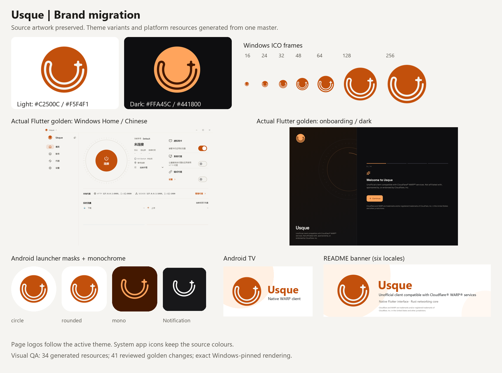
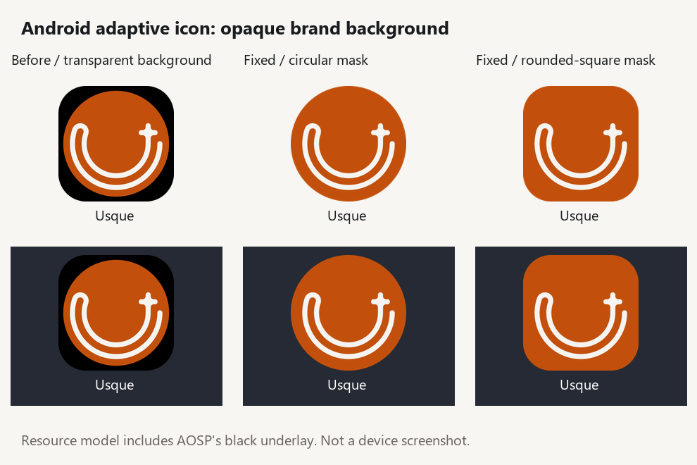

# Usque brand migration validation / 品牌迁移验证

Validation date: 2026-10-06. Baseline:
`808fa67686043fed096bafc89d13ce17e2360556`, plus the uncommitted brand migration
in this working tree. This record does not identify a committed release
candidate and is not installation, networking or publication evidence.

## Result / 结果

The supplied transparent 1600×1600 PNG is the single
[master](../assets/branding/usque-app-icon.png). Its SHA-256 is
`84ee439cc3b26cf21d980f8fa05c202b40bf414b9f7c06683eff5183faf9b432`.
The source bytes match the supplied file. The
[generator](../tool/generate_brand_assets.py) produced 34 resources; repeated
generation produced identical bytes with Pillow 12.3.0 and Windows Segoe UI.

- App icons and light page logos use `#C2500C` / `#F5F4F1`; dark page logos use
  `#FFA45C` / `#441800`, preserving the master alpha channel.
- Partially transparent exterior pixels stay fill-coloured during recolouring,
  preventing a stray circle in the Android line-only masks.
- Launcher art stays centred within 66dp of the 108dp adaptive layer.
  Notifications, shortcuts and the Quick Settings tile share the white U/star
  resource. Android 13+ adaptive icons have a separate monochrome layer.
- Windows ICOs contain 16, 24, 32, 48, 64, 128 and 256-pixel frames. macOS
  resources were refreshed; macOS remains outside current product support.
- TV banners cover all five drawable densities, including the 320×180 xhdpi
  banner. This resolves the IconDensities findings exposed by adding notification
  bitmaps; no lint baseline or suppression was added.
- All 41 changed golden images were reviewed in before/after crops. Differences
  are confined to logos and brand decoration, preserving geometry and copy.
- Setup/uninstall accent text contrast is 4.72:1 light and 7.79:1 dark;
  the 10% black pressed overlay yields 5.59:1 and 6.34:1 respectively.
  High-contrast branches retain their system-colour selection.

The comparison contains actual Flutter fake-engine golden screenshots and
composited platform resource previews. It is not a screenshot of an installed
product or a running VPN.

The six root READMEs share freshly rendered English/light/disconnected Home
previews: [Windows](../assets/screenshots/usque-windows-home.png), 1800×1260
pixels from a 1200×840 viewport at 1.5×; and
[Android](../assets/screenshots/usque-android-home.png), 1290×2796 pixels from a
430×932 viewport at 3×. Both were captured from the current Flutter widgets
using the fake engine and bundled fonts, with the Windows caption enabled only
for the desktop preview. The two rendering checks passed. Their capture script
and log remain in ignored local build directories; no device or native engine
was started. README license badges also use the current light brand colour.

## Commands and results / 命令与结果

Commands follow [CONTRIBUTING](../CONTRIBUTING.md). `python` below denotes the
verified bundled Python 3.12.14 executable, and Flutter/Dart were resolved from
local.properties: Flutter 3.44.7, revision
`84fc5cbb223bc12f83d65b647ff8a56caf779ffd`, Dart 3.12.2. The bootstrapper helper
also received that Python executable through `-PythonPath`.

| Command | Result |
| --- | --- |
| `python tool/generate_brand_assets.py` | passed; palette, alpha, Android bounds, notification masks, ICO frames and repeatability independently checked with Pillow |
| `cargo fmt --all --check` | passed |
| `& ./tool/build_windows_rust_release.ps1 -Variant x64-v2 -CargoAction clippy` | passed |
| `& ./tool/build_windows_rust_release.ps1 -Variant x64-v2 -CargoAction test` | passed; 1,656 tests passed, 8 existing tests ignored |
| `& ./tool/build_windows_rust_release.ps1 -Variant x64-v2` | passed; compile-only; vendored quiche emitted a linker-output warning |
| `& ./tool/build_android_rust.ps1 -AbiFilter arm64-v8a -CargoAction clippy` | passed |
| `flutter pub get --enforce-lockfile` | passed; lockfile retained |
| `dart format --output=none --set-exit-if-changed lib test` | passed |
| `flutter analyze --no-pub` | passed |
| `flutter test --no-pub --tags golden --update-goldens` | passed; 83 tests; Windows-only regeneration followed by visual review |
| `flutter test --no-pub` | passed; 932 tests, including exact golden comparison and new theme/semantics tests |
| `& ../../tool/prepare_windows_plugin_junctions.ps1 -FlutterProject .` | passed |
| `flutter build windows --release --no-pub --split-debug-info=build/symbols/windows` | passed; GUI compiled without launching it |
| `flutter build apk --debug --config-only --no-pub` | passed; no release APK produced |
| `.\gradlew.bat --no-daemon :app:ktlintCheck` | passed |
| `.\gradlew.bat --no-daemon :app:testDebugUnitTest :app:lintDebug` | passed after completing TV densities; 410 JUnit tests, zero failures/errors/skips |
| `& ./tool/build_windows_bootstrapper.ps1 -Variant x64-v2 -OutputDirectory target/bootstrapper-x64-v2 -Test -Preview` | passed; state/child-process tests and separate inert preview compiled |
| `& ./tool/test_windows_installer_authoring.ps1 -Variant x64-v2 -BootstrapperPath target/bootstrapper-x64-v2/usque-setup.exe -OutputDirectory target/branding-installer-authoring-x64-v2` | passed; all 21 cultures/ICE, transforms, bundles, quiet launcher, replacement and temporary signing checks |
| `python -m unittest discover -s tool -p "test_*.py" -v` | passed; 113 tests, including 5 existing Linux-only skips on Windows |
| `ruff check tool` | passed with Ruff 0.16.0 |
| `ruff format --check tool` | passed |
| `pwsh -NoProfile -File tool/check_source.ps1` | passed in the helper-initialized Windows native environment; Python checks rerun after TV density correction |
| `python tool/check_repository_policy.py` | passed |
| `git diff --check` | passed |

The new Rust icon change dependency was exercised by the uninstall debug and
release rebuilds. The source gate includes PSScriptAnalyzer 1.25.0 and Buf
1.72.0. Logs, native/JNI output, temporary authoring fixtures and debug symbols
remain local build artifacts.

## Unavailable validation / 未运行的验证

- `& ./tool/build_windows_bootstrapper.ps1 -Variant arm64 -OutputDirectory
  target/bootstrapper-arm64 -Test`: prerequisite failed because ARM64 Visual
  Studio C++ tools are absent. ARM64 compile/execution validation is `not_run`.
- The matching ARM64 installer authoring matrix is `not_run` because no fresh
  ARM64 bootstrapper could be compiled. x64 evidence does not cover ARM64.
- Native installed tray, launcher, notification, TV and high-contrast appearance
  on actual devices is `not_run`; the comparison uses resources and fake-engine
  screenshots. Protected installation/VPN/lifecycle tests are `not_run`.
- Linux-only Python tests and the eight existing ignored Rust tests were not
  executed. macOS builds, installable validation MSI, release APK, official
  signing and publication were not requested or performed.

## Safety analysis / 安全分析

Changes affect artwork, resource selection, theme colour and icon rebuild
dependencies. Install/uninstall privilege, lifecycle, rollback, fail-closed
decisions and user-data policy retain their existing paths. Native paint code
retains its brush/pen creation and deletion pairs. No new logging, account
access, telemetry or networking operations were introduced. The installer
authoring tests used inert fixtures and their existing temporary identity
cleanup; no installer or installed uninstaller was executed.

## Android transparent background follow-up / 安卓透明背景调整

This experiment is superseded by the 2026-10-09 correction below. Its resource
composites omitted Android's black underlay and did not predict device rendering.
The original date and check results remain historical records.

Follow-up date: 2026-10-07. Tested source: baseline
`64e05304b4887a2bc2e76db8ea2674244da201e3` plus the uncommitted launcher
background and documentation changes. The 2026-10-06 results above remain a
historical record of the original migration.

The rounded white tile came from `ic_launcher_background = #FFFFFF`, clipped
by the launcher's adaptive mask. The shared colour is now `#00000000`; all four
regular/round adaptive definitions, including Android 13+, use it. Existing
foreground PNGs already contain the circular logo with transparent surroundings
and require no regeneration. The 108dp layer, 66dp safe area and line-only
monochrome layer remain in use. This changes only a visual resource; it adds no
permissions, logging, networking or lifecycle operations.

The launcher determines the final mask and effects, as described in
[Android's adaptive icon documentation](https://developer.android.com/develop/ui/compose/system/icon_design_adaptive).
Transparency removes the application's white tile; it cannot force every OEM
launcher to honour transparency or use a circular mask. Themed icons use the
system's background and palette independently of this full-colour background.

Resource checks inspected the four XML definitions and all five foreground
densities, including dimensions, alpha, safe-area bounds and centring. At-rest
resource composites with circular and rounded-square masks preserved the entire
foreground alpha and showed the circular logo against light and dark surfaces.
These composites are resource previews, not installed-device evidence.

Checks for this follow-up used the Flutter 3.44.7 revision
`84fc5cbb223bc12f83d65b647ff8a56caf779ffd` resolved from `local.properties`.
The pinned SDK's binaries supplied the Flutter commands below; resource
inspection used Python 3.12.14 and Pillow 12.3.0.

| Command or check | Result |
| --- | --- |
| `flutter --version --machine` | passed; version and full revision match the CI pin |
| `& ./tool/build_android_rust.ps1 -AbiFilter arm64-v8a -CargoAction clippy` | passed with locked dependencies |
| `flutter pub get --enforce-lockfile` | passed |
| `flutter build apk --debug --config-only --no-pub` | passed; configuration only |
| `.\gradlew.bat --no-daemon :app:ktlintCheck` | passed |
| `.\gradlew.bat --no-daemon :app:testDebugUnitTest :app:lintDebug` | passed; resource compilation and lint completed; unit-test task was up-to-date, with 415 tests and zero failures/errors/skips in its existing reports |
| Resource XML, density, alpha and mask inspection | passed; both masks preserved the full logo without an application-supplied tile |

The Gradle check also compiled debug JNI dependencies for all three supported
ABIs. Its generated libraries and the resource preview remain ignored local
artifacts. This is compile-only evidence, not Android runtime validation.

Actual OEM launcher appearance and Android device validation are `not_run`:
no dedicated device or isolated emulator was used. No release APK, device
installation, signing or publication was performed.

## Android opaque background correction / 安卓不透明背景修正

Correction date: 2026-10-09. Tested source: baseline
`d8a8baa3b21d712ab1a5b2142ca22cd73222a462` plus the uncommitted generator,
Android resource, brand-documentation and comparison-image changes in this
working tree. This does not identify a committed release candidate.

The user reported a black background on an actual Android device after the
transparent-background change. In the
[Android 35 framework source](https://android.googlesource.com/platform/prebuilts/fullsdk/sources/+/refs/heads/androidx-constraintlayout-release/android-35/android/graphics/drawable/AdaptiveIconDrawable.java),
`AdaptiveIconDrawable.draw()` fills its composition bitmap with black before
drawing the background and foreground. A transparent background cannot cover
that black underlay. The earlier PNG-only preview did not model this step;
its successful resource checks were insufficient to establish transparency on
Android. Clearing launcher caches would not correct this resource design.

The shared launcher background is now opaque `#C2500C`. All four regular/round
adaptive definitions continue to reference it. Five regenerated foregrounds
contain only the `#F5F4F1` U/star lines on transparency. The generator preserves
their position and scale relative to the master disk inside the 66dp safe area
of each 108dp layer. It resizes alpha coverage separately and applies the exact
line colour, avoiding colour shifts from premultiplied RGBA interpolation.
Android 13+ monochrome and notification assets are byte-identical to the
baseline. Other platform assets and the editable master remain unchanged.

The comparison models the actual resource layering order: black underlay,
background, foreground, then the viewport mask. It reproduces the previous
black tile and shows the corrected full orange background under circular and
rounded-square masks on light and dark surfaces. Checks verified that the
composition is opaque, contains no exposed black underlay, and preserves the
complete line artwork under both masks. It is a resource model, not a device
screenshot or independent OEM runtime evidence. The launcher still determines
the final shape and effects.

Resource inspection covered the four XML definitions, five density dimensions,
safe-area bounds, alpha and exact line colours. Regenerating all 34 source and
derived resources produced identical bytes with Python 3.12.14, Pillow 12.3.0
and Windows Segoe UI fonts. Flutter checks used 3.44.7, revision
`84fc5cbb223bc12f83d65b647ff8a56caf779ffd`, resolved from `local.properties`.

| Command or check | Result |
| --- | --- |
| `python tool/generate_brand_assets.py` | passed; five changed line-only foreground PNGs; other generated resources unchanged |
| Resource colour, alpha, XML, mask and regeneration inspection | passed; all 34 resource hashes identical on repeat generation; every visible foreground pixel has RGB `#F5F4F1` |
| `flutter --version --machine` | passed; version and full revision match the CI pin |
| `& ./tool/build_android_rust.ps1 -AbiFilter arm64-v8a -CargoAction clippy` | passed with locked dependencies |
| `flutter pub get --enforce-lockfile` | passed |
| `flutter build apk --debug --config-only --no-pub` | passed; configuration only |
| `.\gradlew.bat --no-daemon :app:ktlintCheck` | passed |
| `.\gradlew.bat --no-daemon :app:testDebugUnitTest :app:lintDebug` | passed; 422 tests with zero failures/errors/skips; the final invocation reused the unit-test result and recompiled the final icon resources |
| `ruff check tool` / `ruff format --check tool` | passed with Ruff 0.16.0 through the verified Python executable's `-m ruff` entry point |
| `python -m unittest discover -s tool -p "test_*.py" -v` | passed; 113 tests including five existing Linux-only skips |
| `& ./tool/build_windows_rust_release.ps1 -Variant x64-v2 -CargoAction clippy` | passed; also initialized the supported native environment for the next command |
| `pwsh -NoProfile -File tool/check_source.ps1` | passed in the helper-initialized environment after the final generator adjustment |

Independent device/launcher verification of this correction is `not_run`; no
dedicated device or isolated emulator was used. The user's report establishes
the preceding failure, not verification of this correction. No release APK,
installation, signing or publication was performed. Changes affect only visual
resources and their generator; permission, networking, update and lifecycle
contracts retain their existing paths, with no new logging or personal data.
